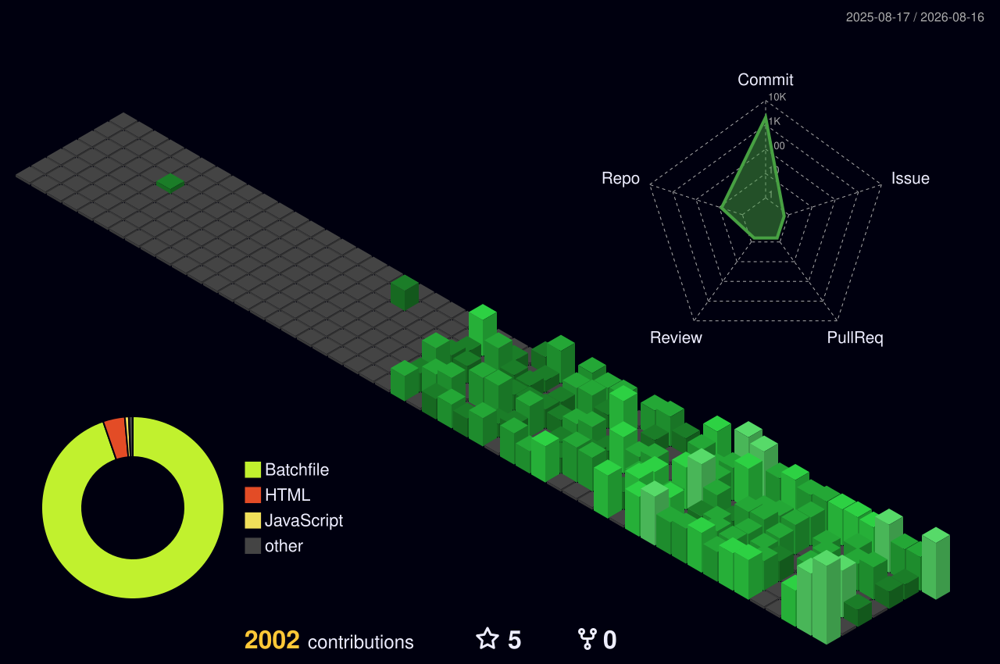

<div align="center">
  _Hello,+I'm+Ibrahim;>_Backend+Systems+Engineer;>_Building+Unshakeable+Foundations;>_Python+|+Linux+|+PostgreSQL" alt="Typing SVG" />
</div>

<p align="center">
  <a href="https://skillicons.dev">
    
  </a>
</p>

---

### 💻 `whoami`
```yaml
Name: Ibrahim
Role: Aspiring Backend + AI Systems Engineer
Status: Diploma CS Student (1st Year)
Philosophy: "First make the foundation unshakeable."
```

### 🚀 `./current_focus.sh`
- **Deep Python Fundamentals:** Core mechanics, OOP, and advanced structures.
- **Backend Architecture:** FastAPI / Flask, Basic Authentication & Validation.
- **Databases:** PostgreSQL & SQL Mastery.
- **SysAdmin:** Git, Linux, HTTP protocols.

### 🎯 `execute_goals.py`
```python
def get_yearly_goal():
    return "Build a strong foundation in Backend Engineering and ship real projects."
```

---

### 🟩 3D Contribution Matrix
<div align="center">
  
</div>

---

### 📊 `system_metrics.json`
<div align="center">
  
  
</div>

<div align="center">
  <br/>
  
</div>

<div align="center">
  <br/>
  
</div>
